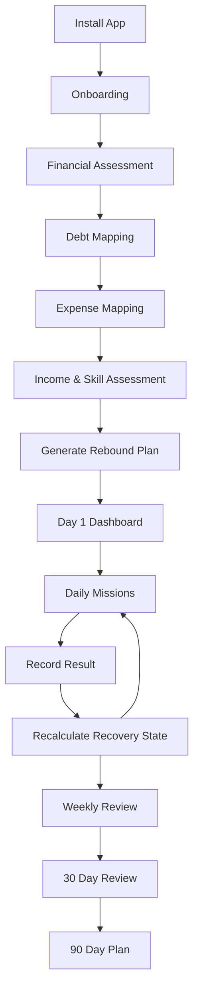
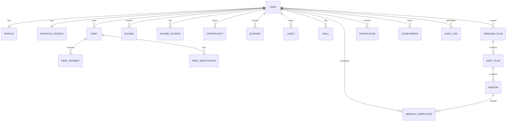

# PRD — Rebound 30

> **Product Requirements Document**
>
> **Product:** Rebound 30  
> **Version:** 1.0.0  
> **Status:** Draft for implementation  
> **Last Updated:** 2026-08-16  
> **Document Type:** Product + Functional + Technical PRD

---

## 1. Executive Summary

**Rebound 30** adalah aplikasi pendamping pemulihan finansial untuk orang yang:

- sedang tidak memiliki pekerjaan;
- memiliki utang;
- memiliki pemasukan tidak stabil;
- sedang mengalami tekanan finansial keluarga;
- membutuhkan rencana tindakan yang konkret untuk 30 hari pertama;
- ingin membangun kembali cashflow dan mengurangi utang secara bertahap.

Aplikasi tidak menjanjikan pengguna dapat melunasi seluruh utang dalam 30 hari.

Tujuan utama produk adalah mengubah kondisi:

> **tidak tahu harus mulai dari mana → memiliki kondisi finansial yang terpetakan → melakukan tindakan harian → menghasilkan cashflow → membangun pemasukan berulang → mengendalikan utang.**

Rebound 30 bukan sekadar expense tracker. Produk menggunakan **action engine** untuk menghasilkan rekomendasi tindakan berdasarkan kondisi pengguna.

---

# 2. Product Vision

> **Membantu seseorang mendapatkan kembali kendali atas hidup finansialnya, satu tindakan konkret setiap hari.**

Aplikasi harus terasa seperti:

- navigator;
- coach;
- financial recovery planner;
- task manager;
- cashflow tracker;

bukan seperti aplikasi pinjaman.

---

# 3. Problem Statement

Orang yang mengalami tekanan utang biasanya menghadapi beberapa masalah sekaligus:

1. Tidak memiliki pemasukan tetap.
2. Tidak mengetahui total utang sebenarnya.
3. Tidak mengetahui pengeluaran minimum.
4. Tidak memiliki prioritas pembayaran.
5. Panik sehingga mengambil keputusan finansial buruk.
6. Tidak tahu cara mendapatkan pemasukan pertama.
7. Hanya fokus mencari pekerjaan formal.
8. Tidak memiliki sistem follow-up.
9. Tidak memiliki catatan perkembangan.
10. Merasa masalah terlalu besar sehingga tidak mulai bertindak.

Aplikasi harus memecah masalah besar menjadi tindakan kecil yang dapat dilakukan setiap hari.

---

# 4. Goals

## 4.1 Primary Goals

1. Membantu pengguna memetakan kondisi finansial.
2. Membuat rencana rebound 30 hari.
3. Membantu pengguna menemukan sumber pemasukan.
4. Membantu pengguna mengontrol pengeluaran.
5. Membantu pengguna memetakan dan memprioritaskan utang.
6. Membantu pengguna melakukan tindakan harian.
7. Mengukur perkembangan cashflow.
8. Membantu pengguna membuat rencana 90 hari.
9. Mengurangi keputusan impulsif saat mengalami tekanan finansial.

## 4.2 Secondary Goals

1. Meningkatkan financial awareness.
2. Meningkatkan konsistensi tindakan.
3. Membantu pengguna membangun pemasukan berulang.
4. Membantu pengguna membuat dokumentasi pembayaran dan negosiasi.
5. Menjadi platform recovery finansial jangka panjang.

---

# 5. Non-Goals

Pada MVP, aplikasi **tidak**:

- memberikan pinjaman;
- menjadi marketplace pinjaman;
- menjamin utang lunas;
- memberikan nasihat hukum sebagai pengganti profesional;
- menjadi bank;
- melakukan investasi otomatis;
- melakukan trading;
- menjadi platform judi/gambling;
- menjanjikan pekerjaan;
- menghubungi kreditur tanpa persetujuan pengguna;
- melakukan pembayaran utang otomatis tanpa explicit confirmation.

---

# 6. Target Users

## 6.1 Primary Persona — Unemployed Debtor

Contoh:

- usia 18–45;
- belum memiliki pekerjaan;
- memiliki utang;
- memiliki skill tertentu;
- memiliki smartphone;
- membutuhkan pemasukan;
- ingin keluar dari kondisi finansial buruk.

## 6.2 Persona — Irregular Income

Pengguna:

- freelancer;
- pekerja harian;
- gig worker;
- usaha kecil;
- pendapatan bulanan tidak stabil.

## 6.3 Persona — Family Financial Burden

Pengguna yang:

- ikut membantu utang keluarga;
- memiliki tanggungan keluarga;
- harus merawat anggota keluarga;
- perlu membagi pemasukan antara kebutuhan hidup dan kewajiban keluarga.

Catatan: aplikasi tidak mengasumsikan bahwa seluruh utang keluarga otomatis menjadi kewajiban hukum pengguna.

---

# 7. Product Principles

## 7.1 Action Over Anxiety

Setiap kondisi buruk harus diterjemahkan menjadi tindakan.

## 7.2 Survival Before Aggressive Debt Payment

Kebutuhan dasar dan kemampuan menghasilkan uang harus dilindungi terlebih dahulu.

## 7.3 Cashflow Before Optimization

Pengguna tanpa pemasukan membutuhkan cashflow sebelum optimasi kecil-kecilan.

## 7.4 No Shame

Aplikasi tidak boleh menggunakan bahasa yang mempermalukan pengguna.

Hindari:

> "Anda gagal mengelola uang."

Gunakan:

> "Kita perlu mencari sumber kebocoran terbesar."

## 7.5 Small Wins

Progress kecil harus terlihat.

## 7.6 Transparent Calculation

Setiap score/recommendation harus dapat dijelaskan.

## 7.7 Privacy First

Data finansial adalah data sensitif dan harus diperlakukan dengan tingkat keamanan tinggi.

---

# 8. Core Product Concept

Rebound 30 menggunakan tiga fase:

```text
SURVIVE
   ↓
CREATE CASH
   ↓
BUILD STABILITY
   ↓
ATTACK DEBT
   ↓
REBUILD
```

Dalam 30 hari:

### Phase 1 — Survival

Hari 1–4

- financial assessment;
- debt mapping;
- expense mapping;
- asset mapping;
- stop unnecessary spending.

### Phase 2 — Create Cash

Hari 5–14

- mencari pekerjaan;
- mencari pekerjaan sementara;
- menjual aset yang aman;
- menawarkan skill;
- mencari client;
- follow-up.

### Phase 3 — Stabilize

Hari 15–21

- membangun pemasukan berulang;
- mengurangi aktivitas yang tidak menghasilkan;
- membuat jadwal;
- melakukan negosiasi.

### Phase 4 — Debt Attack

Hari 22–30

- menentukan prioritas utang;
- membayar sesuai kemampuan;
- tracking outstanding;
- membuat rencana 90 hari.

---

# 9. User Journey



---

# 10. Information Architecture

```text
Home
├── Today
├── Rebound Progress
├── Cashflow
├── Debts
├── Income
├── Expenses
├── Assets
├── Missions
├── Plan
├── Reports
└── Settings
```

---

# 11. Onboarding

## 11.1 Welcome

Message:

> "Kita tidak akan menyelesaikan semuanya hari ini. Kita akan mencari langkah pertama."

CTA:

**Mulai Rebound**

## 11.2 Employment Status

Options:

- Tidak bekerja
- Baru kehilangan pekerjaan
- Freelance
- Pekerja harian
- Usaha kecil
- Bekerja tetapi pemasukan tidak cukup
- Lainnya

## 11.3 Monthly Income

Input:

- amount;
- currency;
- frequency.

## 11.4 Essential Monthly Expenses

Categories:

- food;
- housing;
- electricity;
- water;
- transportation;
- communication;
- healthcare;
- dependents;
- other essential.

## 11.5 Debt

User dapat menambahkan:

- creditor;
- debt name;
- original amount;
- remaining amount;
- interest;
- due date;
- minimum payment;
- collateral;
- status;
- notes.

## 11.6 Assets

Categories:

- cash;
- bank;
- vehicle;
- electronics;
- property;
- business equipment;
- other.

## 11.7 Skills

User memilih skill:

- programming;
- design;
- video editing;
- photography;
- writing;
- translation;
- administration;
- teaching;
- repair;
- sales;
- cooking;
- driving;
- other.

## 11.8 Goal

Options:

- mendapatkan pemasukan pertama;
- mendapatkan pekerjaan;
- mengurangi utang;
- membangun pemasukan rutin;
- membantu keluarga;
- semuanya.

---

# 12. Financial Assessment

Sistem menghitung:

```text
Total Assets
Total Debt
Monthly Income
Essential Monthly Expenses
Monthly Debt Payment
Monthly Cashflow
Debt-to-Income Ratio
Emergency Runway
```

## 12.1 Monthly Cashflow

```text
Monthly Cashflow =
Total Monthly Income - Essential Expenses - Debt Payments
```

## 12.2 Net Position

```text
Net Position =
Total Assets - Total Outstanding Debt
```

## 12.3 Essential Burn

```text
Essential Burn =
Total Essential Monthly Expenses
```

## 12.4 Runway

Jika income > 0:

```text
Runway =
Liquid Cash / Essential Monthly Expenses
```

Jika income = 0:

status:

> `NO_INCOME`

---

# 13. Rebound Score

Score 0–100.

Score bukan ukuran "seberapa baik" seseorang.

Score mengukur **kesiapan dan kontrol recovery**.

## Components

| Component | Weight |
|---|---:|
| Financial visibility | 20 |
| Cashflow | 20 |
| Income activity | 20 |
| Debt control | 15 |
| Expense control | 15 |
| Consistency | 10 |

## Example

```text
Financial Visibility: 80
Cashflow: 20
Income Activity: 60
Debt Control: 40
Expense Control: 70
Consistency: 50

Score = 49
```

UI harus menampilkan:

> **Recovery Score: 49/100**
>
> Fokus utama minggu ini: meningkatkan pemasukan.

Score harus disertai alasan.

---

# 14. Daily Mission Engine

Fitur inti aplikasi.

Setiap hari sistem menghasilkan 3–5 mission.

Contoh:

### User: no income + debt

```text
Mission 1
Hubungi 3 calon pelanggan.

Mission 2
Kirim 5 lamaran pekerjaan yang relevan.

Mission 3
Catat semua pengeluaran hari ini.

Mission 4
Follow-up 2 calon pelanggan.

Mission 5
Jangan mengambil utang konsumtif baru hari ini.
```

## Mission Types

- JOB_APPLICATION
- CLIENT_OUTREACH
- FOLLOW_UP
- SELL_ASSET
- CUT_EXPENSE
- TRACK_EXPENSE
- DEBT_REVIEW
- DEBT_PAYMENT
- NEGOTIATION
- SKILL_BUILDING
- INCOME_TASK
- ADMIN_TASK

---

# 15. Mission Priority

Priority:

```text
CRITICAL
HIGH
MEDIUM
LOW
```

Contoh:

Jika user tidak memiliki makanan untuk 3 hari:

> PRIORITY = CRITICAL

Jika user memiliki utang jatuh tempo besok:

> PRIORITY = HIGH

Jika user belum memperbarui profil skill:

> PRIORITY = LOW

---

# 16. Rebound Engine

Rule-based engine untuk MVP.

Contoh pseudocode:

```python
if income == 0:
    create_mission("CLIENT_OUTREACH", priority="HIGH")
    create_mission("JOB_APPLICATION", priority="HIGH")

if essential_expenses > income:
    create_mission("CUT_EXPENSE", priority="HIGH")

if debt_due_within_7_days:
    create_mission("DEBT_REVIEW", priority="HIGH")

if cash_runway < 7:
    create_mission("INCOME_TASK", priority="CRITICAL")

if user_has_repeat_client:
    create_mission("BUILD_RECURRING_INCOME", priority="HIGH")

if expense_spike_detected:
    create_mission("EXPENSE_REVIEW", priority="MEDIUM")
```

MVP tidak membutuhkan AI.

AI dapat ditambahkan pada fase berikutnya sebagai recommendation layer.

---

# 17. Debt Management

## 17.1 Debt List

Setiap utang menampilkan:

- creditor;
- outstanding;
- minimum payment;
- due date;
- interest;
- collateral;
- risk level;
- status.

## 17.2 Debt Priority

Prioritas mempertimbangkan:

1. kebutuhan hidup;
2. risiko kehilangan aset penting;
3. risiko hukum;
4. jatuh tempo;
5. bunga/denda;
6. nominal;
7. kemampuan negosiasi.

Aplikasi tidak boleh menyederhanakan seluruh utang hanya berdasarkan bunga.

## 17.3 Debt Strategy

User dapat memilih:

### Avalanche

Fokus utang dengan bunga tertinggi.

### Snowball

Fokus utang dengan saldo terkecil.

### Risk First

Fokus kewajiban dengan konsekuensi paling serius.

### Custom

User menentukan prioritas sendiri.

---

# 18. Debt Negotiation Tracker

User dapat membuat record:

```text
Creditor
Contact Person
Date Contacted
Channel
Offer
Response
Next Follow-up
Agreement
Attachment
Notes
```

Status:

- NOT_CONTACTED
- CONTACTED
- NEGOTIATING
- AGREED
- REJECTED
- FOLLOW_UP

Aplikasi hanya mencatat negosiasi.

Tidak menghubungi kreditur otomatis pada MVP.

---

# 19. Income Tracker

## Income Sources

User dapat membuat:

- job;
- freelance;
- client;
- business;
- daily work;
- commission;
- asset sale;
- other.

Fields:

```text
source
category
amount
date
recurring
client
status
notes
```

## Recurring Income

User dapat menandai:

> Recurring = true

Kemudian sistem menghitung:

```text
Estimated Recurring Monthly Income
```

---

# 20. Opportunity Tracker

Untuk orang yang belum bekerja.

Fields:

```text
Opportunity
Company/Client
Type
Expected Income
Date Applied
Status
Follow-up Date
Notes
```

Status:

- SAVED
- APPLIED
- INTERVIEW
- NEGOTIATION
- WON
- LOST
- CANCELLED

---

# 21. Expense Tracker

Categories:

### Essential

- food;
- housing;
- utilities;
- transportation;
- healthcare;
- communication.

### Non-essential

- entertainment;
- subscriptions;
- shopping;
- eating out;
- hobbies;
- other.

Aplikasi harus memberikan warning jika:

```text
non_essential_expense > configured_threshold
```

Namun warning tidak boleh bersifat menghakimi.

---

# 22. Asset Inventory

User dapat mencatat:

```text
Asset Name
Category
Estimated Value
Liquidatable
Needed for Work
Ownership
Notes
```

Important flag:

```text
KEEP_FOR_WORK = true
```

Aset yang diperlukan untuk bekerja tidak boleh direkomendasikan untuk dijual oleh engine default.

---

# 23. 30-Day Plan

Plan terdiri dari:

```text
Day
Objective
Missions
Expected Outcome
Completed
Notes
```

Contoh:

```text
Day 1
Objective:
Understand financial position

Missions:
- Add all debts
- Add essential expenses
- Add cash/assets

Expected Outcome:
Financial baseline complete
```

---

# 24. 90-Day Plan

Setelah hari ke-30, sistem menghasilkan:

### Month 1

Recovery

### Month 2

Income stabilization

### Month 3

Debt attack

User dapat mengubah target.

---

# 25. Dashboard

Dashboard harus menunjukkan:

```text
Recovery Score
Day X / 30

Cash Available
Monthly Income
Essential Expenses
Outstanding Debt

Today's Missions

Income This Month
Debt Paid This Month

Top Priority
```

Contoh:

```text
┌─────────────────────────────┐
│ REBOUND DAY 12 / 30         │
│ Recovery Score: 54          │
├─────────────────────────────┤
│ Cash        Rp 850.000      │
│ Income      Rp 1.700.000    │
│ Expenses    Rp 1.400.000    │
│ Debt        Rp 18.500.000   │
├─────────────────────────────┤
│ TODAY                       │
│ ✓ 5 job applications        │
│ □ Contact 3 clients         │
│ □ Follow up 2 prospects     │
└─────────────────────────────┘
```

---

# 26. Reports

## Monthly Report

Include:

- total income;
- total expenses;
- essential expenses;
- non-essential expenses;
- debt payment;
- outstanding debt;
- new opportunities;
- completed missions;
- score changes.

## Rebound Report

Compare:

```text
Day 1 vs Day 30
```

Example:

```text
Income:
Rp 0 → Rp 2.500.000

Debt:
Rp 25.000.000 → Rp 23.500.000

Recurring income:
Rp 0 → Rp 1.500.000/month
```

---

# 27. Notifications

Notification types:

- daily mission;
- debt due date;
- follow-up;
- weekly review;
- expense warning;
- milestone;
- 30-day completion.

Default notification must be limited.

Avoid notification spam.

---

# 28. Gamification

Gamification should reward behavior, not wealth.

Bad:

> "Anda miskin."

Good:

> "Anda menyelesaikan 7 hari berturut-turut."

Possible badges:

- First Cash
- First Client
- First Follow-up
- 7 Day Streak
- Expense Control
- First Debt Payment
- 30 Day Rebound

Do not use public leaderboards.

Financial hardship is not a competition.

---

# 29. Emergency Mode

If user answers:

> "Saya tidak memiliki uang untuk kebutuhan dasar."

App displays:

1. Emergency checklist.
2. Contact trusted person.
3. Review immediate expenses.
4. Look for legal short-term income.
5. Identify assets that can safely be liquidated.
6. Review available community/support resources.

The application must not provide dangerous or illegal financial suggestions.

---

# 30. Privacy & Security

Financial data must be treated as sensitive.

## Requirements

- HTTPS only.
- Encryption in transit.
- Encryption at rest where supported.
- Password hashing using Argon2id.
- Secure session/token handling.
- Rate limiting.
- Audit logging.
- RBAC for admin.
- No financial data in application logs.
- No sensitive data in analytics payloads.
- Secure backups.
- Account deletion.
- Data export.

## Mobile

- Secure storage for tokens.
- Avoid storing raw credentials.
- Optional biometric unlock.
- Screenshot protection for highly sensitive screens where appropriate.

---

# 31. Authentication

MVP options:

- email + password;
- phone + OTP.

Recommended initial implementation:

```text
Email + Password
```

Optional:

- Google OAuth;
- Apple Sign-In.

---

# 32. User Roles

## USER

Normal application user.

## ADMIN

Manage:

- content;
- missions;
- system configuration;
- user reports;
- aggregated analytics.

## SUPPORT

Can access limited support data with strict permissions.

---

# 33. Data Model

Core entities:

```text
User
Profile
FinancialProfile
Debt
DebtPayment
DebtNegotiation
Income
IncomeSource
Opportunity
Expense
Asset
Skill
Mission
MissionCompletion
ReboundPlan
DailyPlan
Notification
Achievement
AuditLog
```

---

# 34. ERD



---

# 35. Database Requirements

Recommended PostgreSQL.

Important rules:

- use UUID for public identifiers;
- timestamps in UTC;
- currency amount stored as integer minor units or decimal;
- never use floating point for money;
- soft delete where appropriate;
- database constraints for ownership;
- indexes for user_id and dates;
- foreign key constraints;
- transaction around debt payment creation.

Example money:

```text
IDR 1500000

store:
1500000

not:
1500000.00 as float
```

---

# 36. API Architecture

Recommended:

```text
Mobile App
    |
    v
API
    |
    +-- Auth
    +-- User
    +-- Financial
    +-- Debt
    +-- Income
    +-- Expense
    +-- Opportunity
    +-- Mission
    +-- Rebound Engine
    +-- Reports
    |
    v
PostgreSQL
```

Optional:

```text
Redis
Queue Worker
Object Storage
```

---

# 37. REST API

Base:

```text
/api/v1
```

## Auth

```http
POST /auth/register
POST /auth/login
POST /auth/logout
POST /auth/refresh
POST /auth/forgot-password
POST /auth/reset-password
```

## User

```http
GET /me
PATCH /me
DELETE /me
```

## Financial

```http
GET /financial/profile
PUT /financial/profile
GET /financial/summary
GET /financial/score
```

## Debt

```http
GET /debts
POST /debts
GET /debts/{id}
PATCH /debts/{id}
DELETE /debts/{id}

POST /debts/{id}/payments
GET /debts/{id}/payments

POST /debts/{id}/negotiations
GET /debts/{id}/negotiations
```

## Income

```http
GET /income
POST /income
GET /income/{id}
PATCH /income/{id}
DELETE /income/{id}
```

## Expense

```http
GET /expenses
POST /expenses
GET /expenses/{id}
PATCH /expenses/{id}
DELETE /expenses/{id}
```

## Assets

```http
GET /assets
POST /assets
PATCH /assets/{id}
DELETE /assets/{id}
```

## Opportunities

```http
GET /opportunities
POST /opportunities
PATCH /opportunities/{id}
DELETE /opportunities/{id}
POST /opportunities/{id}/follow-up
```

## Missions

```http
GET /missions/today
POST /missions/{id}/complete
POST /missions/{id}/skip
```

## Plan

```http
GET /plan
GET /plan/day/{day}
POST /plan/regenerate
```

## Reports

```http
GET /reports/monthly
GET /reports/rebound
```

---

# 38. API Response Standard

Success:

```json
{
  "data": {},
  "meta": {}
}
```

Error:

```json
{
  "error": {
    "code": "DEBT_NOT_FOUND",
    "message": "Debt was not found."
  }
}
```

Use stable machine-readable error codes.

---

# 39. Recommended Tech Stack

Given the product requirements:

## Mobile

Recommended:

```text
Flutter
```

Reason:

- Android/iOS;
- fast MVP;
- good form support;
- offline-friendly architecture;
- single codebase.

## Backend

Recommended:

```text
FastAPI
Python 3.12+
```

Alternative:

```text
Laravel
```

if the existing team is stronger in PHP.

## Database

```text
PostgreSQL 16+
```

## Cache / Queue

```text
Redis
```

## Storage

```text
S3-compatible object storage
```

## Admin

```text
React + Vite + TypeScript
```

or Laravel/Livewire if speed of internal development is more important.

## Deployment

```text
Docker
Nginx / Caddy
Cloudflare
PostgreSQL
Redis
```

---

# 40. Suggested Repository Structure

```text
rebound30/
│
├── README.md
├── PRD.md
├── LICENSE
├── .gitignore
├── docker-compose.yml
│
├── docs/
│   ├── architecture.md
│   ├── api.md
│   ├── security.md
│   ├── database.md
│   └── decisions/
│
├── backend/
│   ├── app/
│   │   ├── api/
│   │   ├── core/
│   │   ├── models/
│   │   ├── schemas/
│   │   ├── services/
│   │   ├── repositories/
│   │   ├── workers/
│   │   └── main.py
│   ├── tests/
│   ├── Dockerfile
│   └── pyproject.toml
│
├── mobile/
│   ├── lib/
│   │   ├── core/
│   │   ├── features/
│   │   │   ├── auth/
│   │   │   ├── onboarding/
│   │   │   ├── dashboard/
│   │   │   ├── debts/
│   │   │   ├── income/
│   │   │   ├── expenses/
│   │   │   ├── opportunities/
│   │   │   ├── missions/
│   │   │   └── reports/
│   │   └── main.dart
│   └── test/
│
├── admin/
│   ├── src/
│   └── package.json
│
└── infra/
    ├── nginx/
    ├── postgres/
    ├── redis/
    └── docker/
```

---

# 41. MVP Scope

## Must Have

### Authentication

- registration;
- login;
- logout;
- password reset.

### Onboarding

- employment status;
- income;
- essential expenses;
- debt;
- assets;
- skills.

### Dashboard

- financial summary;
- day counter;
- score;
- today's missions.

### Debt

- CRUD;
- payments;
- priority;
- due date.

### Income

- CRUD;
- recurring income.

### Expenses

- CRUD;
- essential/non-essential.

### Opportunities

- job/client tracker.

### Missions

- daily mission;
- complete;
- skip;
- progress.

### Plan

- 30-day plan.

### Reports

- basic monthly report;
- day 1 vs day 30.

---

# 42. Phase 2

- 90-day planner;
- negotiation tracker;
- advanced debt strategies;
- recurring expense detection;
- reminders;
- push notifications;
- achievements;
- export PDF;
- CSV export;
- offline mode;
- improved recommendations.

---

# 43. Phase 3

Potential:

- AI financial coach;
- AI opportunity assistant;
- CV builder;
- job application assistant;
- personalized income ideas;
- local gig discovery;
- community support;
- verified financial education;
- integration with bank/open banking where legally and technically appropriate.

AI must remain a recommendation layer.

It must not make autonomous financial decisions.

---

# 44. AI Assistant Requirements

If AI is implemented:

## AI may

- explain financial concepts;
- summarize user data;
- suggest possible actions;
- help create job application text;
- help write service offers;
- generate negotiation drafts;
- identify spending patterns;
- explain why a mission was recommended.

## AI may not

- guarantee debt settlement;
- impersonate the user;
- contact creditors without confirmation;
- transfer money;
- take loans;
- make investment decisions automatically;
- fabricate legal claims;
- claim certainty about legal obligations.

Every financial recommendation should show:

```text
Why this recommendation?
```

---

# 45. Example AI Interaction

User:

> "Saya belum punya pekerjaan, uang saya tinggal Rp200.000 dan ada utang Rp15 juta."

System:

```text
Kondisi Anda saat ini:

Cash: Rp200.000
Income: Rp0
Debt: Rp15.000.000

Prioritas:
1. Lindungi kebutuhan dasar.
2. Cari pemasukan pertama.
3. Jangan mengambil utang baru.
4. Petakan jatuh tempo utang.

Misi hari ini:
□ Hitung biaya hidup 7 hari.
□ Hubungi 5 calon pelanggan.
□ Kirim 5 lamaran.
□ Catat seluruh utang.
```

---

# 46. UX Requirements

## General

- simple;
- mobile-first;
- readable;
- low cognitive load;
- Bahasa Indonesia sebagai default;
- no shame;
- no financial jargon without explanation.

## Color Semantics

Do not use red everywhere for debt.

Suggested:

- neutral = information;
- blue = action;
- green = progress;
- amber = attention;
- red = genuinely urgent.

---

# 47. Accessibility

Must support:

- scalable text;
- sufficient contrast;
- screen reader labels;
- touch target minimum 44px;
- keyboard navigation on web;
- no color-only status indication.

---

# 48. Offline Support

MVP:

- dashboard cache;
- mission cache;
- local expense entry;
- local income entry.

When online:

```text
local changes
    ↓
sync queue
    ↓
API
```

Conflict handling must use:

```text
updated_at
version
```

rather than silently overwriting data.

---

# 49. Analytics

Do not send raw financial amounts to third-party analytics unless explicitly required and consented.

Track product events:

```text
signup_completed
onboarding_completed
debt_added
income_added
expense_added
mission_completed
mission_skipped
opportunity_added
first_income_recorded
first_debt_payment_recorded
day_7_completed
day_30_completed
```

---

# 50. Product Metrics

## North Star Metric

> **Percentage of active users who complete at least one meaningful recovery action per week.**

## Supporting Metrics

- onboarding completion;
- first debt added;
- first income recorded;
- first mission completed;
- first job application tracked;
- first client outreach tracked;
- first debt payment tracked;
- day 7 retention;
- day 30 completion;
- recurring income adoption.

---

# 51. Safety Metrics

Monitor:

- users reporting no food/basic needs;
- dangerous financial advice feedback;
- excessive notification complaints;
- account takeover attempts;
- suspicious access;
- deletion requests.

---

# 52. Acceptance Criteria — MVP

## Onboarding

- [ ] User can register.
- [ ] User can complete onboarding.
- [ ] User can add financial baseline.
- [ ] User can skip optional fields.
- [ ] Data persists after app restart.

## Debt

- [ ] User can add debt.
- [ ] User can edit debt.
- [ ] User can delete debt.
- [ ] User can record payment.
- [ ] Outstanding amount updates correctly.
- [ ] Due date is displayed.
- [ ] Priority can be changed.

## Income

- [ ] User can record income.
- [ ] Monthly total is calculated.
- [ ] Recurring income is separated.

## Expense

- [ ] User can record expense.
- [ ] Essential/non-essential is stored.
- [ ] Monthly totals are calculated.

## Missions

- [ ] Daily missions are generated.
- [ ] User can complete mission.
- [ ] User can skip mission.
- [ ] Progress updates.

## Dashboard

- [ ] Day number is correct.
- [ ] Score is calculated.
- [ ] Cashflow is displayed.
- [ ] Debt is displayed.
- [ ] Today's missions are displayed.

## Reports

- [ ] Monthly report works.
- [ ] Day 1 baseline is retained.
- [ ] Day 30 comparison is available.

---

# 53. Financial Calculation Tests

All money calculations must have automated tests.

Example:

```text
Income = 3,000,000
Essential Expenses = 2,000,000
Debt Payment = 500,000

Cashflow = 500,000
```

Debt:

```text
Outstanding = 10,000,000
Payment = 750,000

New Outstanding = 9,250,000
```

Never allow:

```text
Outstanding < 0
```

unless overpayment is explicitly supported.

---

# 54. Edge Cases

## User has zero income

System must not calculate negative "income performance" as a failure.

## User has no debt

Skip debt attack.

Focus:

```text
income + savings + stability
```

## User has debt but no assets

Do not suggest asset liquidation.

## User has assets but needs them for work

Mark:

```text
KEEP
```

## User has income but negative cashflow

Prioritize expense review + income growth.

## User enters extremely large values

Validate limits and prevent integer overflow.

## User deletes account

All personal data should follow documented deletion policy.

---

# 55. Security Threat Model

Potential threats:

- credential theft;
- session hijacking;
- unauthorized debt data access;
- IDOR;
- injection;
- broken authorization;
- excessive API requests;
- insecure file uploads;
- sensitive logs;
- backup leakage.

Minimum protections:

- object-level authorization;
- input validation;
- rate limiting;
- secure cookies/token handling;
- CSRF protection where applicable;
- dependency scanning;
- SAST;
- DAST;
- secret management;
- audit logging.

---

# 56. Backup & Recovery

Production:

```text
Daily database backup
+
Point-in-time recovery where supported
+
Encrypted offsite backup
```

Target:

```text
RPO <= 24h
RTO <= 4h
```

Can be tightened as infrastructure matures.

---

# 57. Deployment

Recommended:

```text
Cloudflare
    |
    v
Reverse Proxy
    |
    +---- API
    |
    +---- Admin
          |
          v
       PostgreSQL
          |
        Redis
```

All backend services should run using Docker.

Environment variables:

```text
DATABASE_URL
REDIS_URL
SECRET_KEY
JWT_SECRET
STORAGE_ENDPOINT
STORAGE_BUCKET
SMTP_HOST
SMTP_USER
SMTP_PASSWORD
```

Never commit secrets.

---

# 58. CI/CD

Pipeline:

```text
Push
 ↓
Lint
 ↓
Unit Tests
 ↓
Integration Tests
 ↓
Security Scan
 ↓
Build Docker
 ↓
Deploy Staging
 ↓
Smoke Test
 ↓
Production
```

Branching:

```text
main
develop
feature/*
fix/*
hotfix/*
```

---

# 59. Testing Strategy

## Unit

- financial calculations;
- score;
- mission engine;
- debt priority;
- recurring income.

## Integration

- auth;
- database;
- API;
- payment recording;
- sync.

## E2E

Critical flows:

```text
Register
→ Onboarding
→ Add Debt
→ Add Expense
→ Add Income
→ Complete Mission
→ View Dashboard
```

---

# 60. Content Strategy

The app should contain educational micro-content.

Examples:

### Debt

> "Utang dengan bunga tinggi dapat berkembang lebih cepat. Periksa angka sebenarnya sebelum menentukan strategi."

### Income

> "Saat belum bekerja, jangan hanya mencari lowongan. Cari juga masalah kecil yang bisa Anda selesaikan dan dibayar."

### Expense

> "Pengeluaran kecil yang berulang dapat menjadi kebocoran besar."

Content must be reviewed before production.

---

# 61. Localization

MVP:

```text
id-ID
IDR
```

Future:

```text
en-US
MYR
SGD
SAR
USD
```

Currency must be configurable.

---

# 62. Legal & Compliance Considerations

Before production launch:

- privacy policy;
- terms of service;
- data retention policy;
- account deletion policy;
- consent;
- cookie policy for web;
- financial disclaimer;
- local regulatory review.

If the product later offers financial products, lending, payment services, or regulated financial advice, perform a separate legal/regulatory assessment before implementation.

---

# 63. MVP Roadmap

## Sprint 0 — Foundation

- repository;
- CI/CD;
- Docker;
- database;
- authentication;
- architecture.

## Sprint 1 — Onboarding

- profile;
- financial assessment;
- expenses;
- income;
- debt;
- assets.

## Sprint 2 — Dashboard

- summary;
- score;
- day counter;
- basic mission engine.

## Sprint 3 — Recovery Engine

- daily missions;
- priorities;
- 30-day plan;
- opportunity tracker.

## Sprint 4 — Debt

- payment;
- priority;
- negotiation tracker.

## Sprint 5 — Reports

- monthly report;
- day 1 baseline;
- day 30 comparison.

## Sprint 6 — Hardening

- security;
- testing;
- analytics;
- accessibility;
- performance.

---

# 64. Definition of Done

Feature is considered done when:

- implementation completed;
- unit tests pass;
- integration tests pass;
- authorization tested;
- validation implemented;
- error states implemented;
- loading states implemented;
- empty states implemented;
- analytics event documented if applicable;
- accessibility reviewed;
- documentation updated;
- code reviewed;
- CI passes.

---

# 65. Future Product Direction

Long term, Rebound 30 can evolve into:

```text
Financial Recovery OS
```

with modules:

```text
Recovery
├── Cashflow
├── Debt
├── Income
├── Jobs
├── Skills
├── Opportunities
├── Negotiation
├── Financial Education
└── AI Coach
```

The core principle remains:

> **The application should help users take action, not merely observe that they have a financial problem.**

---

# 66. Final Product Definition

Rebound 30 succeeds when a user can start with:

```text
"I have no job.
I have debt.
I don't know what to do."
```

and, within the first session, arrive at:

```text
"I know my numbers.
I know my priorities.
I have today's tasks.
I know what I can do to earn money.
I know which debt needs attention.
I can see my progress."
```

The product's job is not to promise an easy escape.

Its job is to make the next right action obvious.
